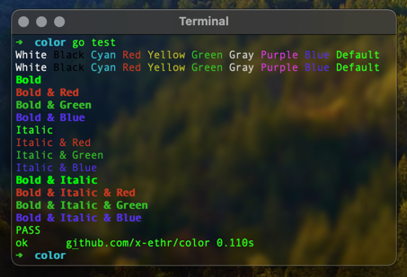

# `color` - ANSI Terminal Color(s)

The `color` package provides terminal escape sequences for giving life to console output.



## Overview

While there exists other packages, `github.com/x-ethr/color` dynamically determines if the given output
device is capable of escaping. For usage with CI and production systems, `color` will automatically disable
adding color to user-provided value(s).

Additionally, users can optionally force color for their own testing purposes if necessary (for users implementing custom
loggers, for example).

## Documentation

Official `godoc` documentation (with examples) can be found at the [Package Registry](https://pkg.go.dev/github.com/x-ethr/color).

## Usage

###### Add Package Dependency

```bash
go get -u github.com/x-ethr/color
```

###### Import & Implement

`main.go`

```go
package main

import (
    "fmt"

    "github.com/x-ethr/color"
)

func main() {
    // --> Write the content "Default" out to stdout without color
    color.Color().Default("Default").Write() // Output: Default

    // --> Write the content "red", "blue", "green" out to stdout with color escapes
    color.Color().red("red").Write() // Output: red
    color.Color().blue("blue").Write() // Output: blue
    color.Color().green("green").Write() // Output: green

    // --> Wrap color(s) with bold color escapes and write to stdout
    color.Color().bold(color.Color().cyan("cyan")).Write() // Output: cyan

    // --> Store the ANSI-modified string to a variable and then format, write the value to stdout
    v := color.Color().italic(color.Color().magenta("magenta")).String()

    fmt.Printf("Example magenta Color Output: %s\n", v)
    // Output: Example magenta Color Output: magenta
}
```

- Please refer to the [code examples](./example_test.go) for additional usage and implementation details.
- See https://pkg.go.dev/github.com/x-ethr/color for additional documentation.

## Contributions

See the [**Contributing Guide**](./CONTRIBUTING.md) for additional details on getting started.
